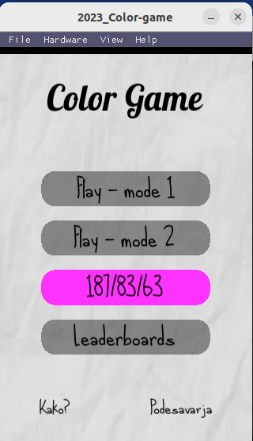
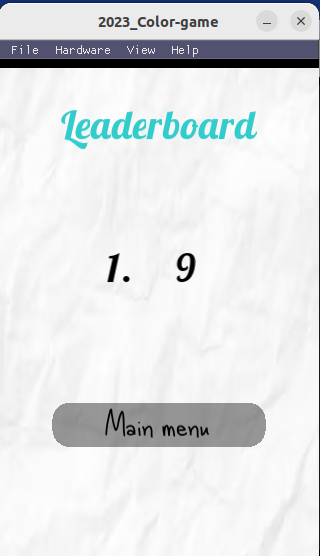
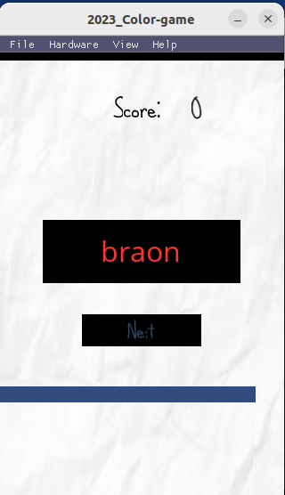
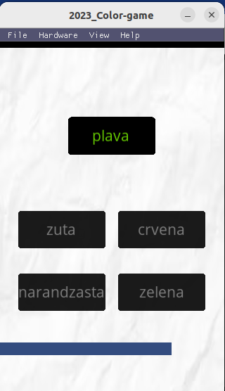

# Color game

[](https://app.codacy.com/gh/matf-pp/2023_Color-game/dashboard?utm_source=gh&utm_medium=referral&utm_content=&utm_campaign=Badge_grade)

A game where your cognitive abilities are taken to the test, with colors!

<p float="left" align="center">
  
  
  
  
</p>


## Run Color game 

The game was written in [Lua](https://www.lua.org/) programming language.

### Linux (Ubuntu)

You will need Solar2d:
```
sudo snap install solar2d
```

Clone the project and navigate to it via terminal:
```
git clone https://github.com/matf-pp/2023_Color-game.git
cd 2023_Color-game
```

If the game screen is not fully displayed, follow the next steps: <br>
File -> clear project sandbox <br>

## Credits

Developed by Ignjatović Petra ([pepi151101](https://github.com/pepi151101)), Filipović Luka ([LukaFilipovic471](https://github.com/LukaFilipovic471)), and Jevtić Stefan ([StefanJevtic63](https://github.com/StefanJevtic63)).
